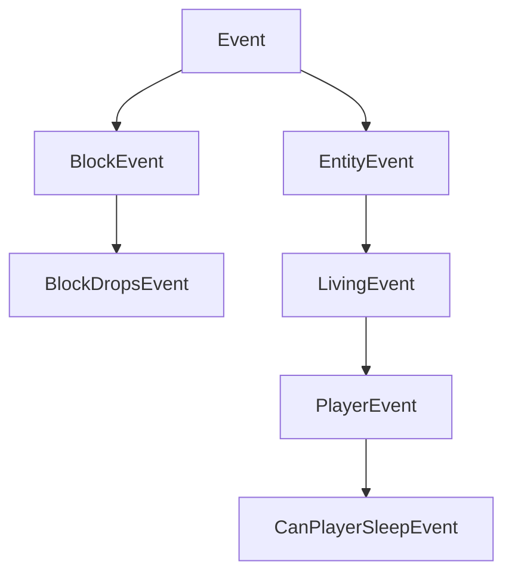

# 事件

NeoForge 的主要功能之一是事件系统。游戏中发生的各种事情都会触发事件。例如，当玩家右键点击时、当玩家或其他实体跳跃时、当方块被渲染时、当游戏加载时等，都会触发事件。MOD 开发者可以为这些事件订阅事件处理器，然后在事件处理器中执行他们想要的行为。

事件在各自的事件总线上触发。最重要的总线是 `NeoForge.EVENT_BUS`，也称为 **游戏** 总线。除此之外，在启动时，会为每个加载的 MOD 生成一个 MOD 总线，并传递给 MOD 的构造函数。许多 MOD 总线事件是并行触发的（与始终在同一线程上运行的主总线事件不同），这大大提高了启动速度。更多信息请参见 [下文][modbus]。

## 注册事件处理器

有多种方法可以注册事件处理器。所有这些方法的共同点是，每个事件处理器都是一个带有单个事件参数且没有返回值（即返回类型为 `void`）的方法。

### `IEventBus#addListener`

注册方法处理器的最简单方法是注册它们的方法引用，如下所示：

```java
@Mod("yourmodid")
public class YourMod {
    public YourMod(IEventBus modBus) {
        NeoForge.EVENT_BUS.addListener(YourMod::onLivingJump);
    }

    // 每当实体跳跃时治疗半颗心
    private static void onLivingJump(LivingEvent.LivingJumpEvent event) {
        LivingEntity entity = event.getEntity();
        // 只在服务端进行治疗
        if (!entity.level().isClientSide()) {
            entity.heal(1);
        }
    }
}
```

### `@SubscribeEvent`

或者，可以通过创建一个事件处理方法并用 `@SubscribeEvent` 注解标记它来实现注解驱动的事件处理。然后，你可以将包含类的实例传递给事件总线，注册该实例中所有带有 `@SubscribeEvent` 注解的事件处理方法：

```java
public class EventHandler {
    @SubscribeEvent
    public void onLivingJump(LivingEvent.LivingJumpEvent event) {
        LivingEntity entity = event.getEntity();
        if (!entity.level().isClientSide()) {
            entity.heal(1);
        }
    }
}

@Mod("yourmodid")
public class YourMod {
    public YourMod(IEventBus modBus) {
        NeoForge.EVENT_BUS.register(new EventHandler());
    }
}
```

你也可以使用静态方法。只需将所有事件处理器设为静态方法，然后传入类本身而不是类实例：
```java
public class EventHandler {
	@SubscribeEvent
    public static void onLivingJump(LivingEvent.LivingJumpEvent event) {
        LivingEntity entity = event.getEntity();
        if (!entity.level().isClientSide()) {
            entity.heal(1);
        }
    }
}

@Mod("yourmodid")
public class YourMod {
    public YourMod(IEventBus modBus) {
        NeoForge.EVENT_BUS.register(EventHandler.class);
    }
}
```

### `@EventBusSubscriber`

我们可以更进一步，用 `@EventBusSubscriber` 注解事件处理类。这个注解会被 NeoForge 自动发现，从而让你可以从 MOD 构造函数中移除所有与事件相关的代码。本质上，它等同于在 MOD 构造函数末尾调用 `NeoForge.EVENT_BUS.register(EventHandler.class)`。这也意味着所有处理器都必须是静态的。

虽然不是必须的，但强烈建议在注解中指定 `modid` 参数，以便于调试（特别是在处理 MOD 冲突时）。

```java
@EventBusSubscriber(modid = "yourmodid")
public class EventHandler {
    @SubscribeEvent
    public static void onLivingJump(LivingEvent.LivingJumpEvent event) {
        LivingEntity entity = event.getEntity();
        if (!entity.level().isClientSide()) {
            entity.heal(1);
        }
    }
}
```

## 事件选项

### 字段和方法

字段和方法可能是事件中最明显的部分。大多数事件包含事件处理器使用的上下文，例如触发事件的实体或事件发生的世界。

### 继承层次

为了利用继承的优势，一些事件不直接继承 `Event`，而是继承它的子类之一，例如 `BlockEvent`（包含与方块相关事件的方块上下文）或 `EntityEvent`（类似地包含实体上下文）及其子类 `LivingEvent`（用于 `LivingEntity` 特定上下文）和 `PlayerEvent`（用于 `Player` 特定上下文）。这些提供上下文的父事件是 `abstract` 的，不能被监听。

:::danger
如果你监听了 `abstract` 事件，游戏将会崩溃，因为这绝不是你想要的结果。你应该总是监听子事件之一。
:::



### 可取消事件

某些事件实现了 `ICancellableEvent` 接口。这些事件可以通过 `#setCanceled(boolean canceled)` 取消，并通过 `#isCanceled()` 检查取消状态。如果事件被取消，该事件的其他事件处理器将不会运行，并且会启用与"取消"相关的某种行为。例如，取消 `LivingChangeTargetEvent` 将阻止实体的目标实体发生变化。

事件处理器可以选择显式接收已取消的事件。这通过在 `IEventBus#addListener`（或 `@SubscribeEvent`，取决于你附加事件处理器的方式）中将 `receiveCanceled` 布尔参数设置为 true 来实现。

### 三态和结果

某些事件有三种潜在的返回状态，由 `TriState` 表示，或者直接在事件类上使用 `Result` 枚举。返回状态通常可以取消事件处理的操作（`TriState#FALSE`），强制操作运行（`TriState#TRUE`），或执行默认的原版行为（`TriState#DEFAULT`）。

具有三种潜在返回状态的事件通常会有某种 `set*` 方法来设置所需的结果。

```java
// 在某个将监听器订阅到游戏事件总线的类中

@SubscribeEvent
public void renderNameTag(RenderNameTagEvent.CanRender event) {
    // 使用 TriState 设置返回状态
    event.setCanRender(TriState.FALSE);
}

@SubscribeEvent
public void mobDespawn(MobDespawnEvent event) {
    // 使用 Result 枚举设置返回状态
    event.setResult(MobDespawnEvent.Result.DENY);
}
```

### 优先级

事件处理器可以选择性地分配优先级。`EventPriority` 枚举包含五个值：`HIGHEST`、`HIGH`、`NORMAL`（默认）、`LOW` 和 `LOWEST`。事件处理器按优先级从高到低的顺序执行。如果它们具有相同的优先级，在主总线上按注册顺序触发（大致与 MOD 加载顺序相关），在 MOD 总线上则严格按照 MOD 加载顺序触发（见下文）。

可以通过在 `IEventBus#addListener` 或 `@SubscribeEvent` 中设置 `priority` 参数来定义优先级，具体取决于你附加事件处理器的方式。请注意，对于并行触发的事件，优先级会被忽略。

### 端特定事件

某些事件仅在特定 [端][side] 触发。常见的例子包括各种渲染事件，它们仅在客户端触发。由于仅客户端的事件通常需要访问 Minecraft 代码库中仅客户端的部分，因此需要相应地注册它们。

使用 `IEventBus#addListener()` 的事件处理器应通过 `FMLEnvironment.dist` 或 MOD 构造函数中的 `Dist` 参数检查当前物理端，并在单独的仅客户端类中添加监听器，如 [端][side] 文章中所述。

使用 `@EventBusSubscriber` 的事件处理器可以将端指定为注解的 `value` 参数，例如 `@EventBusSubscriber(value = Dist.CLIENT, modid = "yourmodid")`。

## 事件总线

虽然大多数事件发布在 `NeoForge.EVENT_BUS` 上，但有些事件发布在 MOD 事件总线上。这些通常称为 MOD 总线事件。MOD 总线事件可以通过它们的超接口 `IModBusEvent` 与常规事件区分开来。

MOD 事件总线作为参数传递给你的 MOD 构造函数，然后你可以将 MOD 总线事件订阅到它。如果你使用 `@EventBusSubscriber`，你也可以将总线设置为注解参数，例如：`@EventBusSubscriber(bus = Bus.MOD, modid = "yourmodid")`。默认总线是 `Bus.GAME`。

### MOD 生命周期

大多数 MOD 总线事件是所谓的生命周期事件。生命周期事件在每次 MOD 启动时运行一次。其中许多事件通过继承 `ParallelDispatchEvent` 并行触发；如果你想在主线程上运行这些事件中的代码，请使用 `#enqueueWork(Runnable runnable)` 将它们加入队列。

生命周期通常遵循以下顺序：

1. 调用 MOD 构造函数。在此处或下一步注册你的事件处理器。
2. 调用所有 `@EventBusSubscriber`。
3. 触发 `FMLConstructModEvent`。
4. 触发注册表事件，包括 [`NewRegistryEvent`][newregistry]、[`DataPackRegistryEvent.NewRegistry`][newdatapackregistry] 以及每个注册表的 [`RegisterEvent`][registerevent]。
5. 触发 `FMLCommonSetupEvent`。这是进行各种杂项设置的地方。
6. 触发 [端][side] 特定设置：在物理客户端上触发 `FMLClientSetupEvent`，在物理服务器上触发 `FMLDedicatedServerSetupEvent`。
7. 处理 `InterModComms`（见下文）。
8. 触发 `FMLLoadCompleteEvent`。

#### `InterModComms`

`InterModComms` 是一个允许 MOD 开发者向其他 MOD 发送消息以实现兼容性功能的系统。该类保存了 MOD 的消息，所有方法都是线程安全的。该系统主要由两个事件驱动：`InterModEnqueueEvent` 和 `InterModProcessEvent`。

在 `InterModEnqueueEvent` 期间，你可以使用 `InterModComms#sendTo` 向其他 MOD 发送消息。这些方法接受要发送消息的 MOD ID、与消息数据关联的键（用于区分不同的消息）以及保存消息数据的 `Supplier`。还可以选择指定发送者。

然后，在 `InterModProcessEvent` 期间，你可以使用 `InterModComms#getMessages` 获取所有接收到的消息流作为 `IMCMessage` 对象。这些对象包含数据的发送者、数据的预期接收者、数据键以及实际数据的供应商。

### 其他 MOD 总线事件

除了生命周期事件外，还有一些杂项事件在 MOD 事件总线上触发，主要是出于历史原因。这些通常是你可以注册、设置或初始化各种东西的事件。与生命周期事件不同，这些事件大多数不是并行运行的。一些例子包括：

- `RegisterColorHandlersEvent.Block`、`.ItemTintSources`、`.ColorResolvers`
- `ModelEvent.BakingCompleted`
- `TextureAtlasStitchedEvent`

:::warning
这些事件大多数计划在未来版本中迁移到游戏事件总线。
:::

[modbus]: #event-buses
[newdatapackregistry]: registries.md#custom-datapack-registries
[newregistry]: registries.md#custom-registries
[registerevent]: registries.md#registerevent
[side]: sides.md
